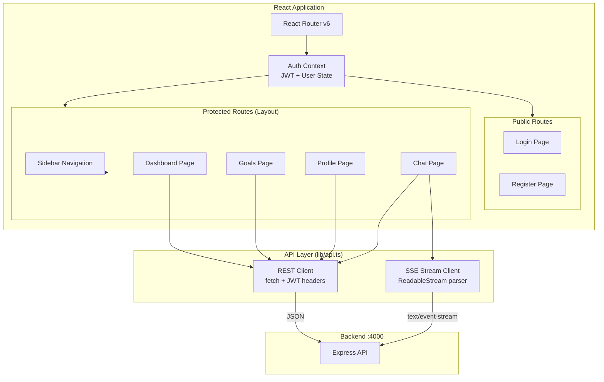
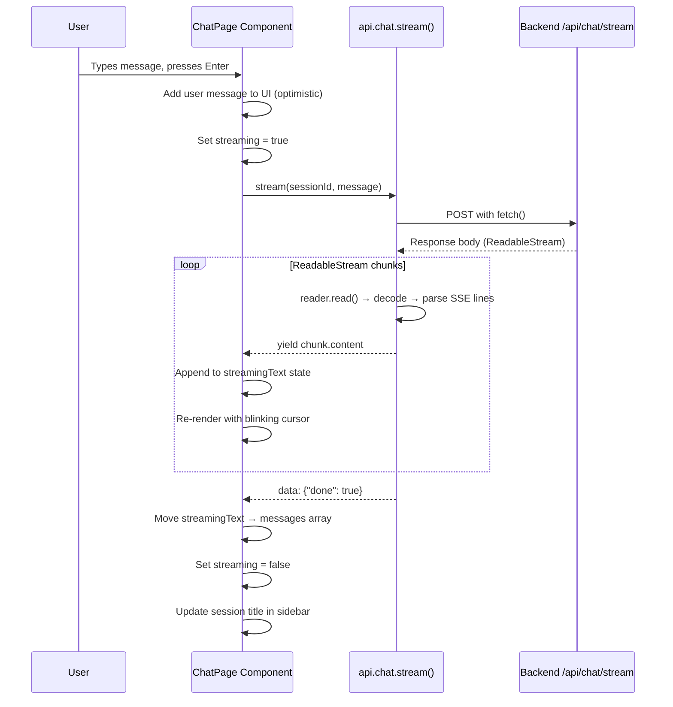
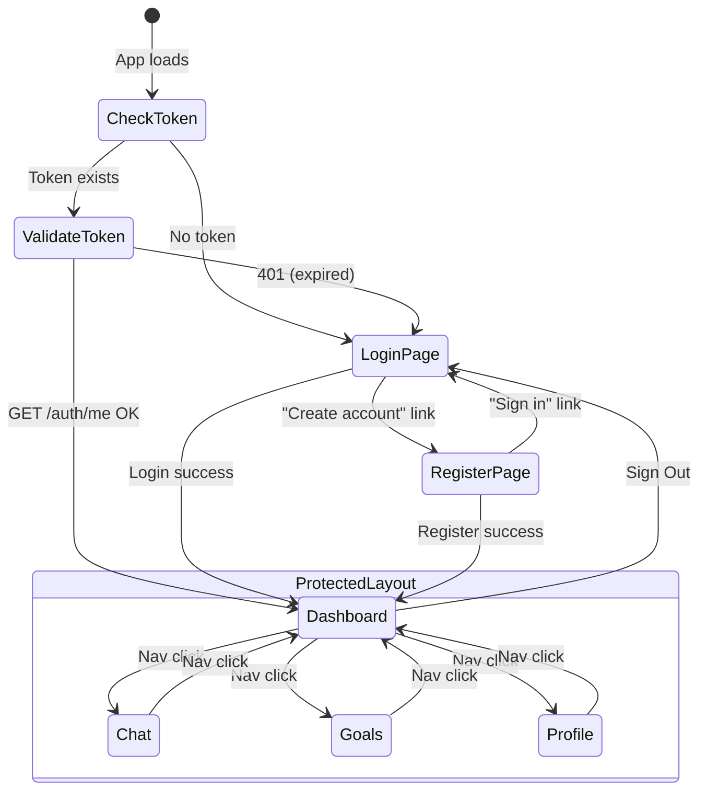
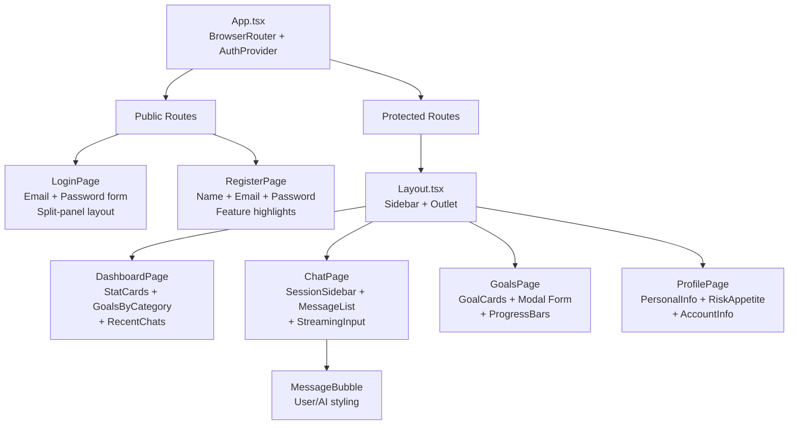

# FinWise AI — Frontend

**React-based UI for the FinWise AI financial advisory platform.** A clean, modern single-page application that lets Indian consumers chat with an AI financial advisor, set and track savings goals, and manage their investment profile.

## What This Project Does

FinWise AI is an AI-powered fintech application for the Indian BFSI (Banking, Financial Services & Insurance) domain. This frontend provides:

- **AI Chat Interface with Real-Time Streaming** — Users converse with a financial advisor AI that responds token-by-token via Server-Sent Events. Supports multiple chat sessions with persistent history, suggested starter prompts, and auto-generated session titles.

- **Goal Tracking Dashboard** — Visual cards showing savings goals with progress bars, amounts in INR (Indian numbering: lakhs/crores), category badges, and deadline tracking. At-a-glance stats on the dashboard show total targets, overall progress percentage, and goals on track.

- **Financial Goal Management** — Full CRUD for savings goals across categories: Retirement, Education, Home Purchase, Emergency Fund, Travel, and Investment. Each goal tracks current vs. target amount with visual progress.

- **Risk Profile Settings** — Users select their investment risk appetite (Conservative / Moderate / Aggressive), which personalizes the AI advisor's recommendations between safe instruments (FDs, PPF) and higher-risk options (small-cap equity, direct stocks).

### Why This Exists

This project demonstrates a production-quality React + TypeScript frontend for a fintech product — the kind of consumer-facing app a startup like Pluto Money would build. It covers JWT authentication, real-time SSE streaming, responsive layouts, and Docker-based deployment.

---

## Architecture

### Frontend Application Structure



### SSE Streaming — How the Chat Works



### Page Navigation & Auth Flow



### Component Tree



---

## Tech Stack

| Layer | Technology |
|-------|-----------|
| Framework | React 19 |
| Language | TypeScript (strict) |
| Build | Vite |
| Styling | Tailwind CSS v4 |
| Routing | React Router v6 |
| Icons | Lucide React |
| State | React Context (Auth) + local useState |
| HTTP | Native fetch API |
| Streaming | ReadableStream + SSE parsing |
| Containerization | Docker (multi-stage: Node builder + Nginx) |
| CI/CD | GitHub Actions |

---

## Pages

| Page | Route | Description |
|------|-------|-------------|
| Login | `/login` | Split-panel layout with gradient branding. Email + password form. |
| Register | `/register` | Account creation with feature highlights. Name + email + password. |
| Dashboard | `/dashboard` | 4 stat cards (goals, target savings, progress %, conversations). Goals by category breakdown. Recent chat sessions list. |
| AI Advisor | `/chat` | Left sidebar with chat sessions (create/delete). Main chat area with message bubbles. SSE streaming with blinking cursor. Suggested starter prompts for new sessions. |
| Goals | `/goals` | Grid of goal cards with progress bars, category badges, INR formatting. Modal form for create/edit. Category selector, deadline picker. |
| Profile | `/profile` | Personal info editor. Risk appetite radio selector (Conservative/Moderate/Aggressive) with descriptions. Account creation date. |

---

## Project Structure

```
finwise-frontend/
├── src/
│   ├── main.tsx                # App entry point
│   ├── App.tsx                 # Router + auth guards (ProtectedRoute / PublicRoute)
│   ├── index.css               # Tailwind CSS imports
│   ├── context/
│   │   └── AuthContext.tsx     # Auth state, login/register/logout, JWT management
│   ├── lib/
│   │   └── api.ts              # API client (REST + SSE stream), TypeScript interfaces
│   ├── components/
│   │   └── Layout.tsx          # Sidebar navigation + user info + Outlet
│   └── pages/
│       ├── LoginPage.tsx       # Login form with split-panel design
│       ├── RegisterPage.tsx    # Registration form with feature list
│       ├── DashboardPage.tsx   # Stats overview + recent activity
│       ├── ChatPage.tsx        # AI chat with SSE streaming
│       ├── GoalsPage.tsx       # Goals CRUD with modal + progress bars
│       └── ProfilePage.tsx     # Profile editor + risk appetite
├── .github/workflows/
│   ├── ci.yml                  # Type-check + build
│   └── build-deploy.yml        # Build Docker, push to ECR, deploy to EC2
├── Dockerfile                  # Multi-stage: Vite build → Nginx serve
├── docker-entrypoint.sh        # Runtime backend URL injection for Nginx
├── nginx.conf                  # Serves SPA + proxies /api to backend
├── .dockerignore
├── .env.example
├── vite.config.ts              # Vite + Tailwind + dev proxy
├── package.json
└── tsconfig.json
```

---

## Setup

### Prerequisites

- Node.js 22+
- FinWise Backend running on port 4000

### Local Development

```bash
# Clone and install
git clone <repo-url>
cd finwise-frontend
npm install

# Configure environment
cp .env.example .env

# Start dev server (hot-reload + API proxy)
npm run dev
# App available at http://localhost:4100
# API calls proxy to http://localhost:4000
```

### Docker

```bash
docker build -t finwise-frontend .
docker run -d -p 4100:4100 \
  --add-host=host.docker.internal:host-gateway \
  --name finwise-frontend finwise-frontend
```

The Nginx config inside the container proxies `/api/*` requests to the backend at `finwise-backend:4000` via Docker network DNS. Override with `-e BACKEND_URL=http://custom:4000` at runtime.

---

## Deployment

Push to `main` triggers GitHub Actions:
1. `ci.yml` — type-check + production build
2. `build-deploy.yml` — Build Docker image, push to ECR, SSH into EC2, pull image, load secrets from AWS Secrets Manager, run container

Required GitHub Secrets: `AWS_ACCOUNT_ID`, `EC2_HOST`, `EC2_SSH_KEY`

See [docs/deployment.md](docs/deployment.md) for full setup instructions.

---

## Design Decisions

- **No state management library** — React Context for auth (global), local `useState` for everything else. The app is simple enough that Redux/Zustand would be overhead.
- **Native fetch over Axios** — SSE streaming requires `ReadableStream` parsing which works natively with fetch. No need for a library wrapper.
- **Tailwind v4** — Utility-first CSS with no component library dependency. Keeps the bundle small (22KB gzipped CSS) and the design fully custom.
- **Optimistic UI updates** — User messages appear instantly in the chat before the API confirms. Goal creates/updates reflect immediately in the UI.
- **No recharts/chart library** — Dashboard uses simple stat cards and text breakdowns. Charts would add bundle weight for minimal value at this stage.
db changed